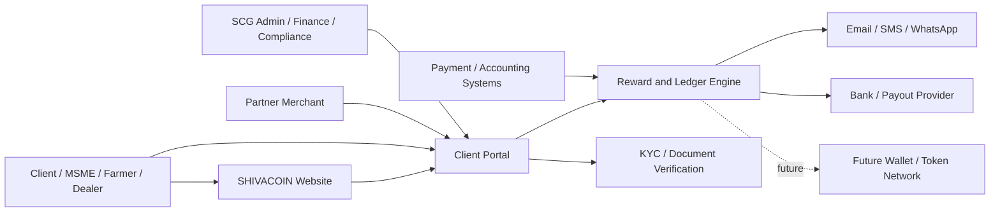
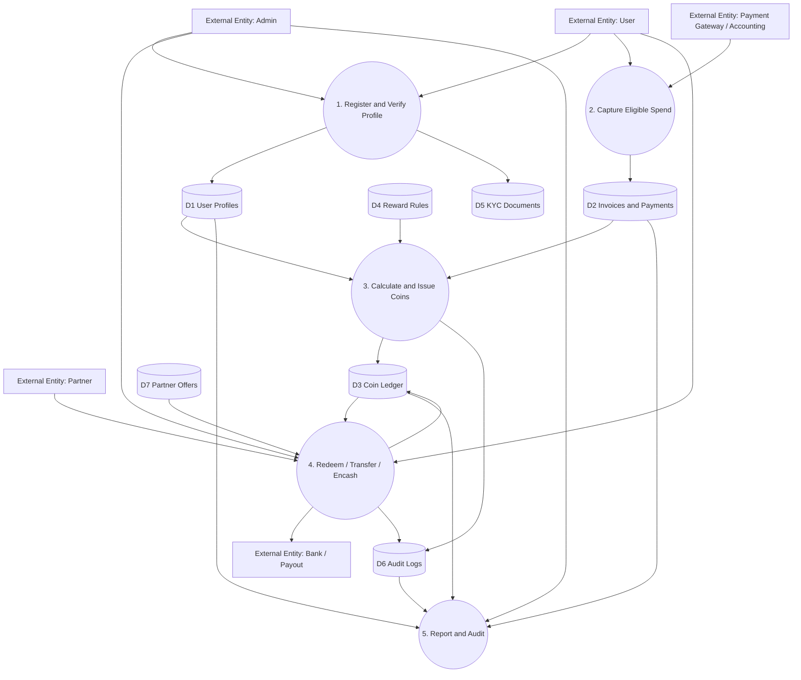
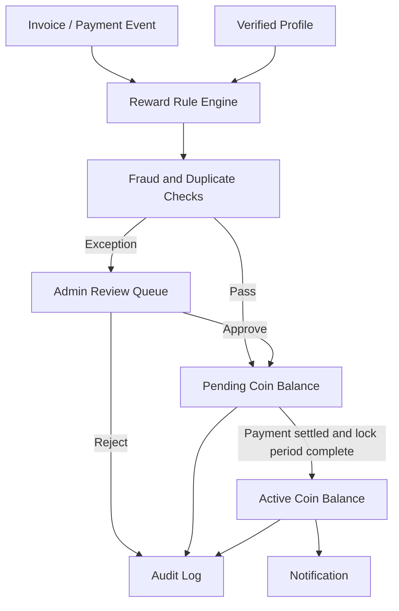
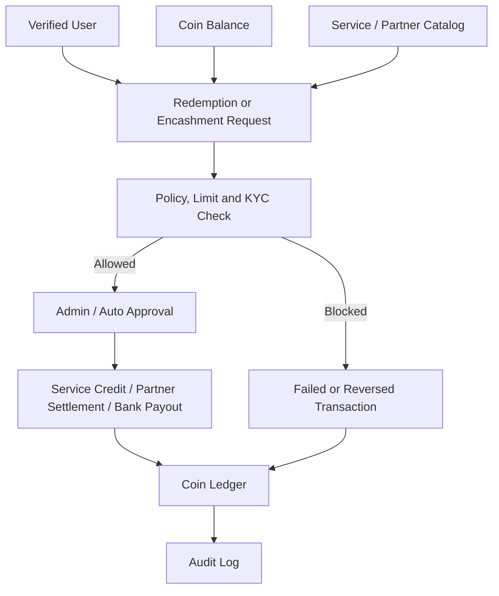
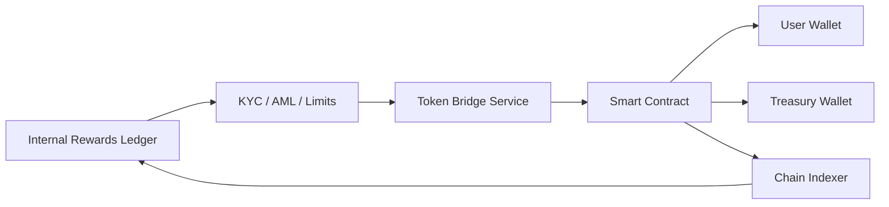

# SHIVACOIN System Architecture and DFD

Date: 12 May 2026

## 1. Architecture Principles

- Loyalty ledger first, blockchain optional later.
- Every coin movement must be auditable.
- No reward without verified business event.
- Encashment and transfer must be gated by KYC, limits and compliance review.
- Public website should generate leads; portal should manage verified activity.
- Admin workflows should be scalable across services, sectors, partners and campaigns.

## 2. High-Level Components

| Layer | Components |
| --- | --- |
| Public layer | Marketing website, reward calculator, inquiry capture, white paper, compliance disclosures |
| Identity layer | Client registration, organization profile, KYC, roles, consent |
| Business layer | Service catalog, eligible spend, invoice ingestion, payment status, partner offers |
| Reward layer | Rule engine, coin issuance, pending/active balances, redemption, reversal, expiry |
| Liquidity layer | Transfer, encashment, partner settlement, payout controls |
| Admin layer | User management, KYC review, reward approval, campaign rules, dispute handling |
| Data layer | PostgreSQL ledger, document store, audit log, reporting warehouse |
| Integration layer | Websites, CRM, accounting, payment gateway, notification provider, partner APIs |
| Future chain layer | Smart contract, wallet, custody, bridge, chain indexer, AML monitoring |

## 3. Recommended MVP Stack

| Need | Recommendation |
| --- | --- |
| Frontend | Next.js or React-based responsive web app |
| Backend | Node.js/NestJS or Django/FastAPI |
| Database | PostgreSQL with immutable ledger tables |
| Admin | Role-based admin console |
| Auth | Email/mobile OTP plus passwordless option |
| Files | Object storage for KYC and documents |
| Notifications | Email, SMS, WhatsApp provider |
| Hosting | Vercel/Cloudflare for frontend; managed backend and database |
| Analytics | Product analytics plus finance ledger reports |

## 4. Context Diagram

## 5. Level 0 DFD

## 6. Level 1 DFD - Reward Issuance

## 7. Level 1 DFD - Redemption and Encashment

## 8. Core Data Model

### users

- id
- name
- email
- mobile
- user_type
- status
- created_at

### organizations

- id
- legal_name
- gstin
- pan
- sector
- address
- verification_status

### profiles

- user_id
- organization_id
- role
- onboarding_source
- consent_status

### invoices

- id
- organization_id
- invoice_number
- invoice_date
- gross_amount
- eligible_amount
- payment_status
- source_system

### reward_rules

- id
- rule_name
- spend_threshold
- reward_value
- eligible_categories
- start_date
- end_date
- status

### ledger_entries

- id
- account_id
- entry_type
- amount
- status
- reference_type
- reference_id
- running_balance
- created_at
- created_by

### redemptions

- id
- account_id
- redemption_type
- requested_amount
- approved_amount
- status
- settlement_reference

### audit_logs

- id
- actor_id
- action
- entity_type
- entity_id
- before_hash
- after_hash
- created_at

## 9. Ledger Rules

- Use append-only ledger entries; do not overwrite historical balances.
- Store running balance for speed but verify through ledger reconciliation.
- Use idempotency keys for invoice/payment events.
- Separate pending, active, locked, redeemed, expired and reversed balances.
- Require maker-checker approval for manual adjustments and encashment.

## 10. Security and Compliance Controls

- Role-based access control.
- MFA for admins.
- Encryption at rest and in transit.
- KYC document access controls.
- Immutable audit logs.
- Suspicious activity rules.
- Rate limits and bot protection.
- Payout approval limits.
- Data retention and consent management.
- Periodic ledger reconciliation.

## 11. Deployment Environments

| Environment | Purpose |
| --- | --- |
| Development | Feature work and internal testing |
| Staging | UAT, content approval, compliance checks |
| Production | Live website and verified transactions |
| Reporting replica | Analytics and finance reporting without production write risk |

## 12. Future Blockchain Architecture

Tokenization should not be implemented until the business has legal clearance, an audited smart contract, treasury controls and AML monitoring.

